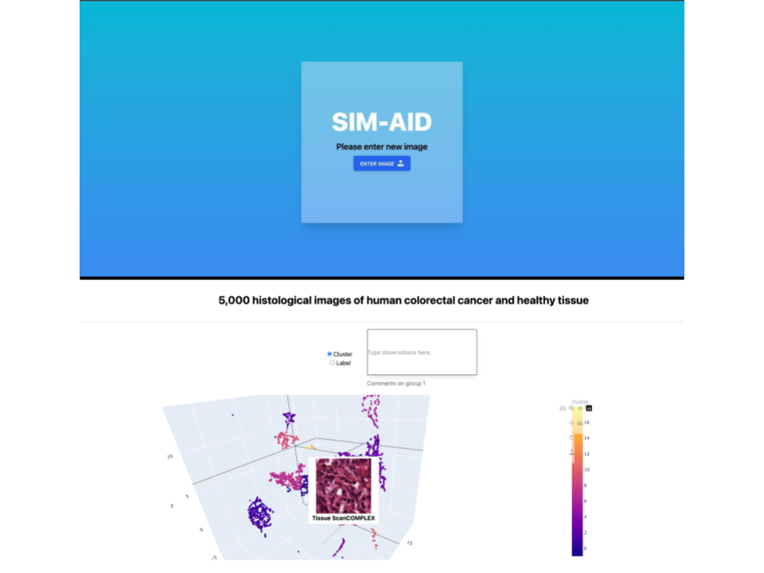
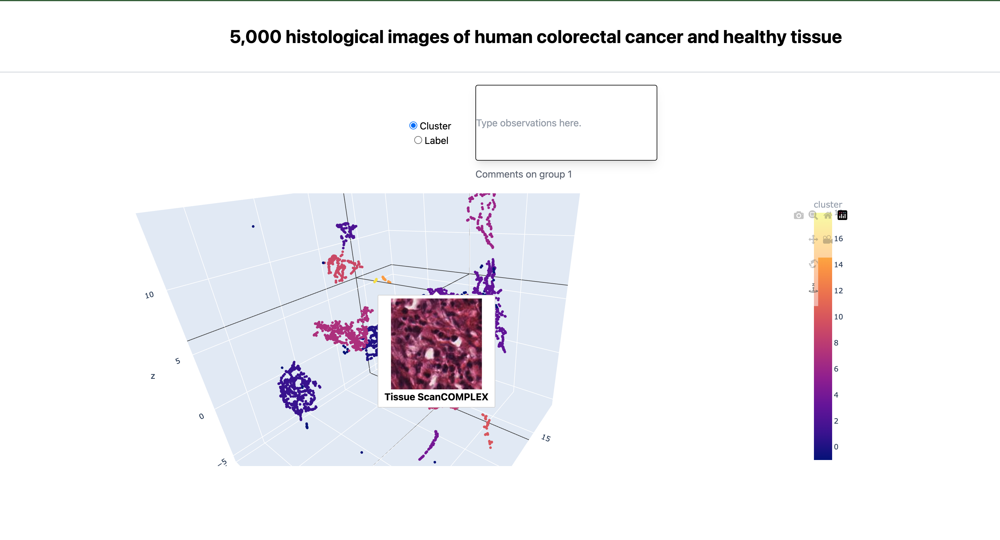

# SIM-AID: A Simple Framework for Interpretable AI Diagnostics

## Overview


SIM-AID is a two step process to convert any black-box medical image diagnostic model into one that is interpretable and accompanied by lab technicians annotations. 

## Setups

[](https://www.python.org/downloads/release/python-3810/)
[](https://pytorch.org/get-started/previous-versions/)
[

### Quickstart

Download the data used in our demo here: https://drive.google.com/file/d/1-2GY2NCJjKhHZCgpK2_HoiaWXi21MbJ8/view?usp=share_link and store in the parent directory. You can then skip the rest of the requirements (unless you would like to run the workflow on your own dataset). 

### Requirements

First, create a virtual environment with conda (or venv):

```bash 
conda create -n simaid python==3.8.10
conda activate simaid
```

Install OpenSlide and OpenJPEG (with the package manager of your choice):
```bash 
brew install openslide
...
brew install openjpeg
```

Install the Tissue Analysis Toolbox and Dash. We found it was easier to use pip. Beware, there are a quite a few dependencies
```bash
pip install tiatoolbox dash
```

### Download the Kather5k dataset
```
cd data
bash download_downstream.sh
```

## Phase I: Labelling
```bash
python app.py
```

## Phase II: Explanation
```bash
npm install
npm run dev
```

## Screenshots



## Citations


```bibtex
@misc{https://doi.org/10.5281/zenodo.1214456,
  doi = {10.5281/ZENODO.1214456},
  url = {https://zenodo.org/record/1214456},
  author = {Kather,  Jakob Nikolas and Halama,  Niels and Marx,  Alexander},
  keywords = {colorectal cancer,  histopathology,  histology,  digital pathology,  image classification},
  title = {100, 000 Histological Images Of Human Colorectal Cancer And Healthy Tissue},
  publisher = {Zenodo},
  year = {2018},
  copyright = {Creative Commons Attribution 4.0}
}

@article{
    Pocock2022,
    author = {Pocock, Johnathan and Graham, Simon and Vu, Quoc Dang and Jahanifar, Mostafa and Deshpande, Srijay and Hadjigeorghiou, Giorgos and Shephard, Adam and Bashir, Raja Muhammad Saad and Bilal, Mohsin and Lu, Wenqi and Epstein, David and Minhas, Fayyaz and Rajpoot, Nasir M and Raza, Shan E Ahmed},
    doi = {10.1038/s43856-022-00186-5},
    issn = {2730-664X},
    journal = {Communications Medicine},
    month = {sep},
    number = {1},
    pages = {120},
    publisher = {Springer US},
    title = {{TIAToolbox as an end-to-end library for advanced tissue image analytics}},
    url = {https://www.nature.com/articles/s43856-022-00186-5},
    volume = {2},
    year = {2022}
}

@dataset{kather_jakob_nikolas_2018_1214456,
  author       = {Kather, Jakob Nikolas and
                  Halama, Niels and
                  Marx, Alexander},
  title        = {{100,000 histological images of human colorectal 
                   cancer and healthy tissue}},
  month        = apr,
  year         = 2018,
  publisher    = {Zenodo},
  version      = {v0.1},
  doi          = {10.5281/zenodo.1214456},
  url          = {https://doi.org/10.5281/zenodo.1214456}
}
```
